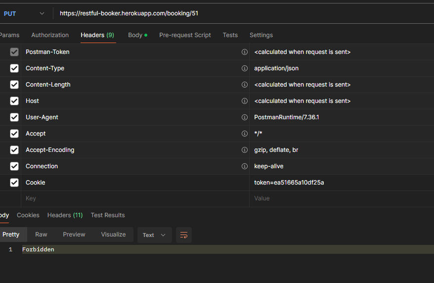

# 1. UI TESTING

1.2.1 Login com diferentes tipos de usuários disponíveis

---

standard_user:
-

- Faz o login corretamente

1.2.2 Ordenação e filtragem de produtos:
- Ordena corretamente.

1.2.3 Fluxo completo de compra (do carrinho até finalização):
- Finaliza até o carrinho de compras.

1.2.4 Remoção de itens do carrinho:
- Consigo remover do carrinho.

1.2.5 Navegação entre páginas:
- Navergação entre as paginas funcionando corretamente.

1.2.6 Logout:
- Logout realizado com sucesso.

----
locked_out_user
-
- Retorna com erro já na pagina inicial e não permite o login.

----
problem_user
- 
- Contém apenas foto de cachorro.

1.2.2 Ordenação e filtragem de produtos:
- Não filtra e nem ordena.

1.2.3 Fluxo completo de compra (do carrinho até finalização):
- Não consigo cadastrar usuário ele não deixa colocar o sobrenome.

1.2.4 Remoção de itens do carrinho:
- Permite remover o item corretamente

1.2.5 Navegação entre páginas:
- Navegação funciona.

1.2.6 Logout:
- Logout realizado com sucesso.

----
performance_glitch_user
-

1.2.2 Ordenação e filtragem de produtos:
- Ele filtra e ordena mas com lentidão.

1.2.3 Fluxo completo de compra (do carrinho até finalização):
- Funcionando mas com lentidão.

1.2.4 Remoção de itens do carrinho:
- Funcionando.

1.2.5 Navegação entre páginas:
- Contém erro no JS, mas não interfere na navegação.

1.2.6 Logout:
- Logout realizado com sucesso.

----
error_user
-

- Possui um erro que ocorre em todos os usuários, na descrição do produto informa o código da pagina.

1.2.2 Ordenação e filtragem de produtos:
- Não ordena retorna com erro.

1.2.3 Fluxo completo de compra (do carrinho até finalização):
- Não permite cadastrar o sobrenome e por esse motivo não permite avançar o status da compra.

1.2.4 Remoção de itens do carrinho:
- É possivel remover os itens.

1.2.5 Navegação entre páginas:
- Funcionando.

1.2.6 Logout:
- Logout realizado com sucesso.

----
visual_user
-

1.2.2 Ordenação e filtragem de produtos:
- Funcionando.

1.2.3 Fluxo completo de compra (do carrinho até finalização):

1.2.4 Remoção de itens do carrinho:
- Consigo remover o item do carrinho.

1.2.5 Navegação entre páginas:
- O checkout está com bug visual indo para o canto superior da tela

1.2.6 Logout:
- Logout realizado com sucesso.

----
# 2. API TESTING

2.2.1.1 Gerar token de autenticação:
- Token gerado com sucesso.

2.2.1.2 Tentar gerar token com credenciais inválidas:
- Requisição bloqueada corretamente.

2.2.2 Gestão de reservas:
-
2.2.2.1 Criar uma nova reserva:
- Reserva criada com sucesso.

2.2.2.2 Buscar uma reserva específica:
- Reserva localizada corretamente.

2.2.2.3 Listar todas as reservas:
- Reservas listadas com sucesso.

2.2.2.4 Atualizar uma reserva existente:
- Atualização proibida.

2.2.2.5 Deletar uma reserva:
- Deleção proibida.

2.2.3 Filtros e buscas:
2.2.3.1 Buscar reservas por nome:
- Funcionando corretamente.

2.2.3.2 Buscar reservas por data de check-in:
- Funcionando corretamente.
  

2.2.3.3 Buscar reservas por data de check-out:
- Funcionando corretamente.

----
1.3.1.3 Sugestões de melhorias de UX/UI.

- Encontramos algumas inconsistências em alguns usuários onde a navegação não estava funcionando corretamete. E também identificamos que para casos de sites de compras talvez não seja o mais interessante utilizar o menu sanduiche.

1.3.1.4 Lista de bugs encontrados (se houver).

Na navegação em um dos logins possui um bug que dificulta a navegação.

- Imagens incorretas em determinados usuários.
- Erros de ordenação e filtragem para alguns usuários.
- Persistência de itens no carrinho após logout.

1.3.1.5 Análise de riscos da aplicação:

- Identificamos uma falha de segurança expos todos os id existentes, isso pode comprometer e ocorrer um vazamento de dados.

- Foi feito teste passando o mesmo id de uma reserva criada, mas teve um bom resultado

.

1.3.2.1 Testes de responsividade:

- Testes preliminares foram realizados com sucesso, interface responsiva.

1.3.2.2 Testes de acessibilidade:
- Testes preliminares indicam que a acessibilidade está processada no backend.
